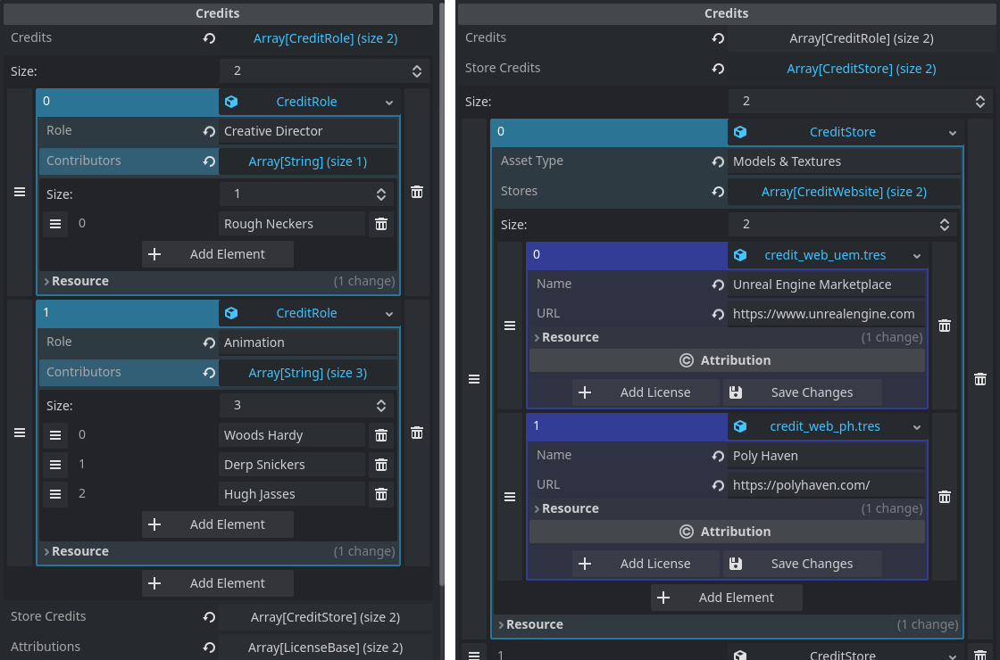
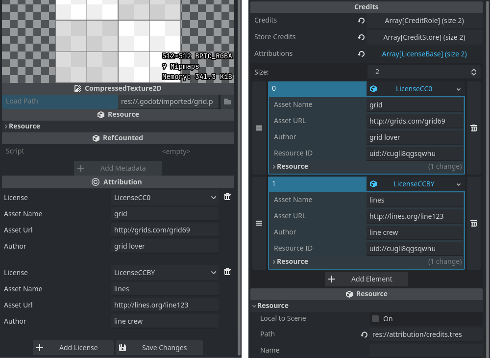

# Attribution Manager

This plugin provides developers with tools to store video game credits and manage
attributions for individual assets. It aims at making it easy to give correct attribution
to assets imported from third parties and keeping the attribution up to date.

Credits can be collected manually and automatically. They're stored in a single
resource that can be hooked up easily to any kind of credits scene. Credits for the
various roles in game development can be entered directly and with as many contributors
for each role as necessary. There is also a convenient resource type for crediting
entire asset stores.

Attributions for imported resources are entered in the inspector. There are pre-made
attribution types for the most common CC-style licenses found on the various asset
stores around the internet. The attributions are stored automatically in the credits
resource and update when attributions for an asset are changed or the asset is deleted.

